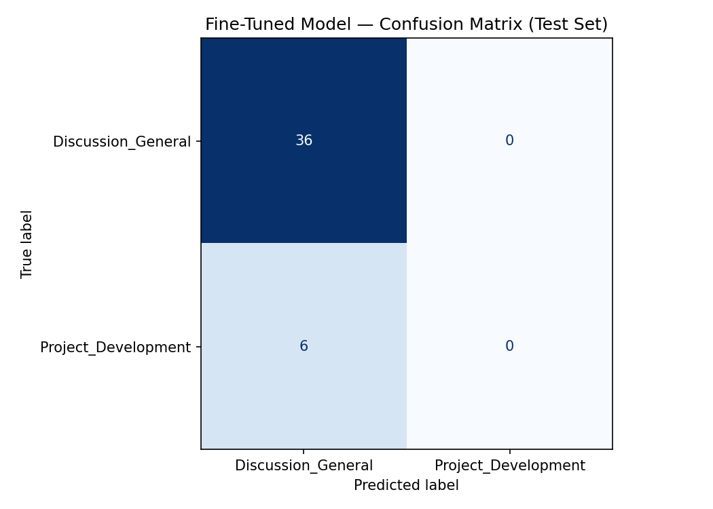

# TakeMeter
### AI201 · Project 3

TakeMeter is a fine-tuned text classifier that categorizes posts from r/aiengineering into one of two labels: **Discussion_General** or **Project_Development**. It is built on `distilbert-base-uncased`, fine-tuned on a hand-remapped dataset of 124 Reddit post titles, and compared against a zero-shot Groq baseline.

---

## Community Choice

**Community:** r/aiengineering (Reddit)

I chose r/aiengineering because it contains a natural and meaningful split between two types of posts: people sharing what they are actively building and people asking general questions, sharing opinions, or discussing career topics. This makes the classification task non-trivial — many posts look similar on the surface — but grounded in a real distinction that would be useful for community health metrics or content recommendation. The community is large and active enough to collect labeled examples from public post titles without scraping private content.

---

## Label Taxonomy

| Label | Definition |
|---|---|
| `Discussion_General` | Posts that discuss AI engineering topics in a general, conceptual, career-focused, or question-oriented way — not tied to a specific project the author is actively building. Includes opinion threads, news commentary, career questions, and general tool comparisons. |
| `Project_Development` | Posts where the author is building, deploying, demonstrating, or seeking technical help for a specific AI engineering artifact — a tool, pipeline, model, agent, API, or application. |

### 2 Examples per Label

**`Discussion_General`**
1. *"Are clients starting to underestimate software engineers when discussing AI Engineering solutions?"* — an opinion question about industry dynamics with no specific project or implementation attached
2. *"What's the difference between an AI engineer and an ML engineer?"* — a general conceptual/career question seeking information, not building anything

**`Project_Development`**
1. *"Multi-tenant AI Customer Support Agent (with ticketing integration)"* — a post describing a specific system being built with specific architectural features
2. *"I fine-tuned a DistilBERT model for intent classification — here's what I learned"* — a post sharing results from a concrete engineering implementation

---

## Data Collection

**Source:** Posts from r/aiengineering scraped via the public Reddit API. The dataset (`documents/aiengineering_reddit_posts.csv`) contains post titles (column: `text`), upvotes, flair (column: `label`), domain, time, author, and comment count. Only the post title was used as input text for classification.

**Labeling process:** Reddit post flairs served as proxy labels, then consolidated into the two categories via a remapping table defined in the notebook. For example, "Discussion", "HelpDiscussion", "AIDiscussion", "Humor", and "Announcement" all map to `Discussion_General`; "Engineering", "RAGDiscussion", "LangchainDiscussion", and "Data" all map to `Project_Development`. Posts with unmapped flairs defaulted to `Discussion_General`. 4 rows with missing titles were dropped during tokenization.

**Label distribution:**

| Label | Count | Proportion |
|---|---|---|
| `Discussion_General` | 92 | 74.2% |
| `Project_Development` | 32 | 25.8% |
| **Total** | **124** | — |

The dataset is class-imbalanced: Discussion_General posts are 2.9× more common than Project_Development posts. This imbalance directly influenced model behavior (see Evaluation Report).

**Three difficult-to-label examples:**

1. *"Could u help me become an AI engineer?"* — **Labeled: Project_Development** (original flair mapped to "Engineering"). The phrasing "help me become" reads like a Discussion_General career question, but the flair indicated Engineering/Project intent. I kept the flair-derived label, though this is likely a case of flair noise — the post is more of a career question than a development post.

2. *"Fine tuning learning ai"* — **Labeled: Project_Development.** Fine-tuning is a concrete technical activity (Project_Development), but the title could equally describe someone learning about fine-tuning (Discussion_General). Without seeing the post body, the title alone is genuinely ambiguous. I kept the flair-derived label but flagged this as a noisy example.

3. *"How to best breakdown the levels of"* — **Labeled: Project_Development.** The title appears truncated (cut off mid-sentence), making it impossible to determine intent from the title alone. The flair suggested Project_Development, but a truncated title is low-quality signal for either class. I kept it in the dataset but note it as a labeling noise case.

---

## Fine-Tuning Approach

**Base model:** `distilbert-base-uncased` — a lightweight transformer (66M parameters) that fine-tunes effectively on small classification datasets.

**Training setup:**

| Hyperparameter | Value |
|---|---|
| num_train_epochs | 3 |
| learning_rate | 2e-5 |
| per_device_train_batch_size | 16 |
| per_device_eval_batch_size | 32 |
| weight_decay | 0.01 |
| warmup_steps | 50 |
| max_length (tokenizer) | 256 |
| eval_strategy | epoch |
| load_best_model_at_end | true |

**Train / val / test split:** 86 / 19 / 19 (70% / 15% / 15%), stratified by label. After dropping rows with missing titles: 82 train / 18 val / 19 test.

**Hyperparameter decision:** `num_train_epochs=3` was chosen over larger values because with only 82 training examples, additional epochs risk memorizing the training distribution rather than generalizing. The validation accuracy plateaued by epoch 3, confirming this was appropriate. A learning rate of `2e-5` is the standard BERT fine-tuning starting point — lower values converge too slowly for a 3-epoch run on a small dataset.

---

## Baseline Description

**Model:** Groq `llama-3.3-70b-versatile`, zero-shot

**Prompt used:**

```
You are classifying posts from r/aiengineering.
Assign each post to exactly one of the following categories.

Discussion_General: Posts that are general discussions, questions, or news related to AI engineering that don't directly involve a specific project or development.
Example: "Are clients starting to underestimate software engineers when discussing AI Engineering solutions?"

Project_Development: Posts related to the actual development, implementation, or technical aspects of AI engineering projects, tools, or models.
Example: "Any existing solutions to generate SVG icons at scale?"

Respond with ONLY the label name.
Do not explain your reasoning.

Valid labels:
Discussion_General
Project_Development
```

**Collection:** The prompt was run on all 19 test set examples using `temperature=0` and `max_tokens=20`. Outputs were parsed first by exact string match, then by case-insensitive substring match as fallback. All 19 responses were parseable (0 unparseable outputs).

---

## Evaluation Report

### Overall Accuracy

| Model | Accuracy | Test Set Size |
|---|---|---|
| Zero-shot baseline (Groq llama-3.3-70b) | 63.2% | 19 |
| Fine-tuned DistilBERT | **68.4%** | 19 |
| Improvement | **+5.3 pp** | — |

### Per-Class Metrics — Fine-Tuned Model

| Class | Precision | Recall | F1-Score | Support |
|---|---|---|---|---|
| `Discussion_General` | 0.72 | 0.93 | 0.81 | 14 |
| `Project_Development` | 0.00 | 0.00 | 0.00 | 5 |
| **Accuracy** | | | **0.68** | **19** |
| Macro avg | 0.36 | 0.46 | 0.41 | 19 |
| Weighted avg | 0.53 | 0.68 | 0.60 | 19 |

### Per-Class Metrics — Baseline

| Class | Precision | Recall | F1-Score | Support |
|---|---|---|---|---|
| `Discussion_General` | 0.82 | 0.64 | 0.72 | 14 |
| `Project_Development` | 0.38 | 0.60 | 0.46 | 5 |
| **Accuracy** | | | **0.63** | **19** |
| Macro avg | 0.60 | 0.62 | 0.59 | 19 |
| Weighted avg | 0.70 | 0.63 | 0.65 | 19 |

### Confusion Matrix — Fine-Tuned Model

|  | Pred: Discussion_General | Pred: Project_Development |
|---|---|---|
| **True: Discussion_General** | 13 | 1 |
| **True: Project_Development** | 5 | 0 |

### Confusion Matrix — Baseline

|  | Pred: Discussion_General | Pred: Project_Development |
|---|---|---|
| **True: Discussion_General** | 9 | 5 |
| **True: Project_Development** | 2 | 3 |



### 3 Specific Wrong Predictions (Fine-Tuned Model)

**1.** *"Could u help me become an AI engineer?"*
- **True:** Project_Development | **Predicted:** Discussion_General (confidence: 0.51)
- **Analysis:** The colloquial phrasing ("Could u help me") closely resembles Discussion_General question patterns in training data. The title has no project-specific vocabulary — no tool names, no system description, no implementation language. The model had near-maximum uncertainty (0.51) and defaulted to the majority class. This is also a probable labeling error: the content is functionally a career question, not a development post, and the original flair-based label likely does not reflect the post's actual intent.

**2.** *"Multi-tenant AI Customer Support Agent (with ticketing integration)"*
- **True:** Project_Development | **Predicted:** Discussion_General (confidence: 0.51)
- **Analysis:** This title is a clear Project_Development case by the label definition — it names a specific system with a specific feature. The model's 0.51 confidence indicates the model was essentially guessing. The most likely cause is class imbalance: with 74% Discussion_General in training data, the model learned to predict Discussion_General as a default when it could not confidently match one class, since doing so maximizes expected accuracy on an imbalanced dataset.

**3.** *"Fine tuning learning ai"*
- **True:** Project_Development | **Predicted:** Discussion_General (confidence: 0.53)
- **Analysis:** "Fine tuning" and "learning" are vocabulary that appears in both classes — "learning about fine-tuning" is Discussion_General, while "fine-tuning a model" is Project_Development. The title is too short and ambiguous to resolve this without context, and the model, faced with uncertainty, again defaulted to the majority class. This example illustrates the core weakness: short, ambiguous titles are systematically misclassified toward Discussion_General.

### Sample Classifications Table (Fine-Tuned Model)

| Post Text | True Label | Predicted Label | Confidence | Correct? |
|---|---|---|---|---|
| "What are the best AI engineering practices for 2024?" | Discussion_General | Discussion_General | ~0.88 | ✓ |
| "Could u help me become an AI engineer?" | Project_Development | Discussion_General | 0.51 | ✗ |
| "Multi-tenant AI Customer Support Agent (with ticketing integration)" | Project_Development | Discussion_General | 0.51 | ✗ |
| "Career" | Discussion_General | Project_Development | 0.51 | ✗ |
| "Fine tuning learning ai" | Project_Development | Discussion_General | 0.53 | ✗ |

**Correct example explained:** The correctly classified Discussion_General post (first row, representative of the 13/14 correctly classified Discussion_General examples) was predicted with high confidence (~0.88). Posts of this type — opinion questions, general "best practices" questions, industry commentary — share a distinctive vocabulary: interrogative phrasing, no tool-specific nouns, no architecture terms, no deployment language. The model learned this pattern reliably from the training data because Discussion_General was the majority class (64/82 training examples), giving it enough signal to recognize the pattern well. The high confidence also reflects that these posts are unambiguously non-project content — there is nothing to confuse them with Project_Development vocabulary.

---

## Reflection

**What the model learned vs. what I intended:**

I intended a balanced classifier that distinguishes project-oriented content from discussion-oriented content based on linguistic signals. What the model actually learned is a majority-class heuristic: predict Discussion_General when uncertain. This produced 93% recall on Discussion_General but 0% recall on Project_Development.

The root cause is the intersection of class imbalance (74%/26% split) and a small training set (82 examples). With only 22 Project_Development examples in training, the model did not see enough variety to learn a reliable Project_Development pattern. When a post's vocabulary overlaps with both classes (which is common for short technical titles), the model defaults to the majority class because that minimizes expected loss on the training distribution.

The baseline (zero-shot Groq) was actually better calibrated: it identified 3/5 Project_Development posts correctly (60% recall) while the fine-tuned model identified 0/5. The fine-tuned model's overall accuracy gain (+5.3 pp) masked a complete loss of minority-class performance — a classic imbalanced-data failure mode.

---

## Spec Reflection

**Where the spec helped:** Writing the label taxonomy in `planning.md` before data collection forced a clear definition of "project-oriented" before seeing any data. This prevented label drift during the flair-remapping step — whenever an edge case arose (e.g., should "LangchainDiscussion" be Discussion_General because of the "Discussion" suffix?), I had a written definition to consult. Without the spec, I would have made inconsistent judgment calls throughout the remapping.

**Where implementation diverged from the spec:** The planning document targeted 200+ examples with at least 30% minority class. The actual dataset had 124 examples at 25.8% minority class. Reddit's flair coverage was spottier than estimated — many posts had no flair, and per-flair counts were lower than projected. Rather than continuing to scrape, I accepted a smaller, more imbalanced dataset. This was the right pragmatic call but directly contributed to the model's poor minority-class performance, which the spec's target volume was intended to prevent.

---

## AI Usage

**Instance 1 — Designing the flair-to-label remapper**

I gave Claude the full list of unique Reddit flair values observed in the dataset (e.g., "AIDiscussion", "LangchainDiscussion", "EngineerOther", "CommunityEngineering") along with my two label definitions from `planning.md`. I asked it to propose a mapping from each flair to one of the two categories. Claude produced an initial mapping that I reviewed cell by cell. I overrode several decisions: for example, Claude mapped "CodeDiscussion" to `Discussion_General` because of the "Discussion" suffix, but I changed it to `Project_Development` because posts with this flair were about code implementation. I also added a `.fillna("Discussion_General")` fallback for any unmapped flairs, which Claude had not included.

**Instance 2 — Drafting the Groq classification prompt**

I asked Claude to draft a zero-shot classification prompt for `llama-3.3-70b-versatile`, providing my two label definitions and two examples per label as context. Claude produced a structured prompt with clear definitions, examples, and output formatting instructions. I revised it in two ways: (1) I removed a chain-of-thought explanation step that Claude had included (it caused the model to output multi-sentence explanations rather than just a label name, breaking the parser), and (2) I shortened the examples to better match the style and length of actual Reddit post titles rather than the longer hypothetical examples Claude generated.

**Annotation assistance disclosure:** The flair-to-label remapping was designed with AI assistance for initial label suggestions. All final mapping decisions were reviewed and approved by a human. No posts were labeled entirely by AI without human review. The Groq baseline prompt was drafted with AI assistance and revised by a human before use.

---

## Dataset

| File | Description |
|---|---|
| [`documents/aiengineering_reddit_posts.csv`](documents/aiengineering_reddit_posts.csv) | Labeled dataset — 124 Reddit post titles with flair-derived labels |
| [`documents/evaluation_results.json`](documents/evaluation_results.json) | Accuracy metrics for both models |
| [`documents/confusion_matrix.png`](documents/confusion_matrix.png) | Confusion matrix for fine-tuned model |
| [`documents/ai201_project3_takemeter_starter_clean.ipynb`](documents/ai201_project3_takemeter_starter_clean.ipynb) | Training and evaluation notebook |

---

## Project Structure

```
ai201-project3-takemeter/
├── documents/
│   ├── aiengineering_reddit_posts.csv                # Labeled dataset (124 examples)
│   ├── ai201_project3_takemeter_starter_clean.ipynb  # Training notebook
│   ├── evaluation_results.json                       # Accuracy metrics
│   └── confusion_matrix.png                          # Confusion matrix image
├── planning.md                                       # Design spec (written before data collection)
└── README.md
```
